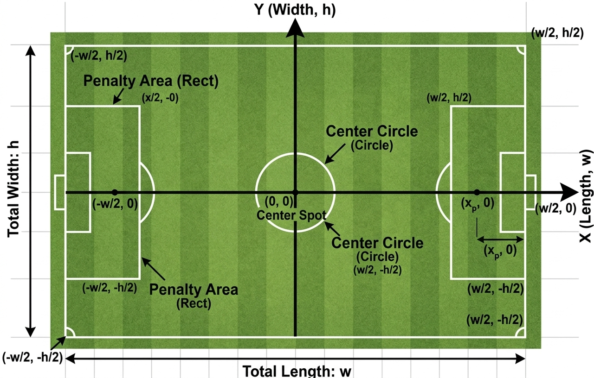
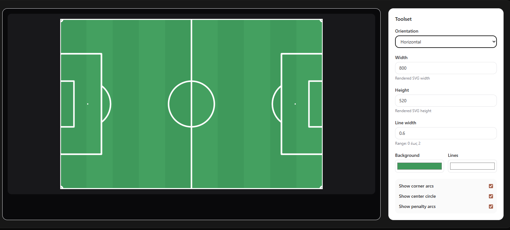
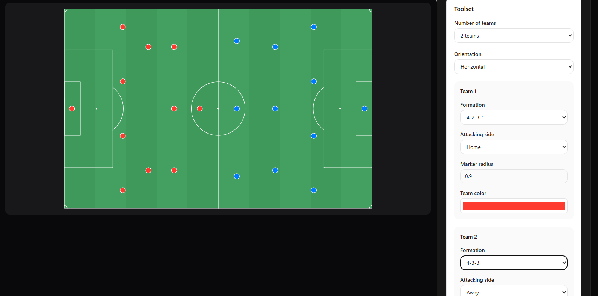

# ⚽ Football Visualizer

> **“Imagine the pitch as a coordinate system — where every movement is geometry.”**

  

A lightweight, flexible React + SVG library for building football (soccer) visualizations — lineups, formations, movements, and tactical diagrams.

Designed with a clean API, scalable coordinate system, and interactive use cases in mind.

---

## ✨ Features

- ⚽ SVG-based pitch rendering
- 📐 Consistent aspect ratio (real pitch proportions)
- 🎯 Clean and predictable API (`width`, `height`)
- 🧩 Composable components (players, lines, zones)
- 🔄 Scalable coordinate system (pixel or normalized)
- 🧪 Built-in demo & documentation environment

---

## 🏟️ Football Pitch

## 🧠 Formation Layer

> **“Structured team shapes, rendered as geometry.”**

  

The `FormationLayer` is a tactical overlay built on top of the core pitch system.  
It transforms football formations into visual player layouts, using consistent pitch coordinates and opinionated defaults for standard team shapes.

With support for common formations, mirrored home/away layouts, and configurable marker styling, it provides a clean foundation for lineup views, tactical boards, and interactive visual tools.
